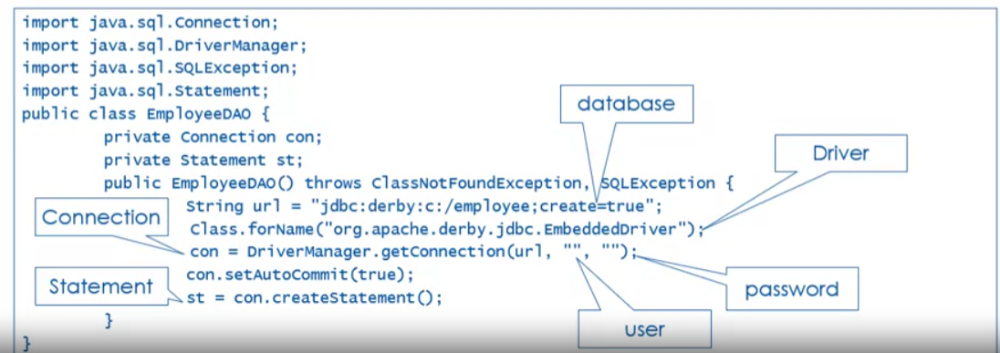
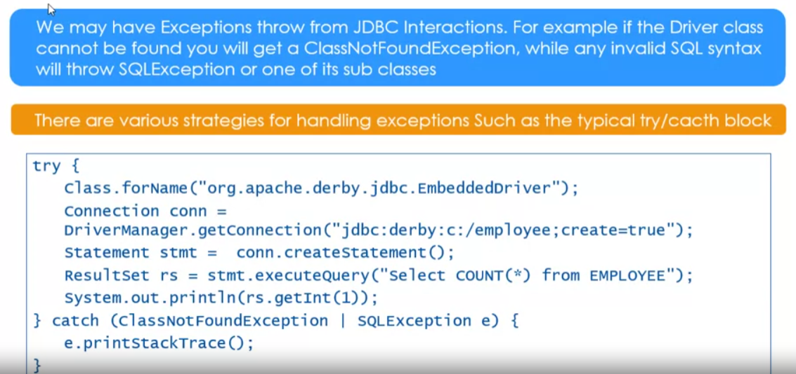
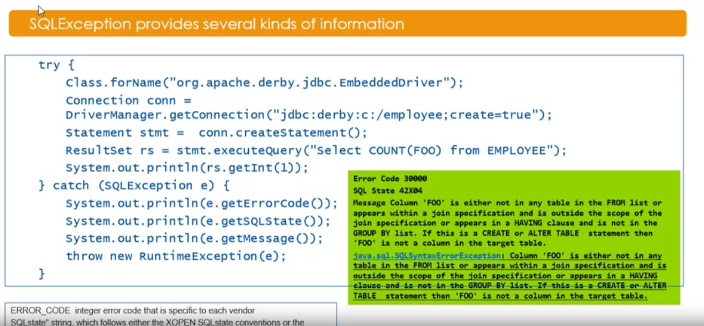
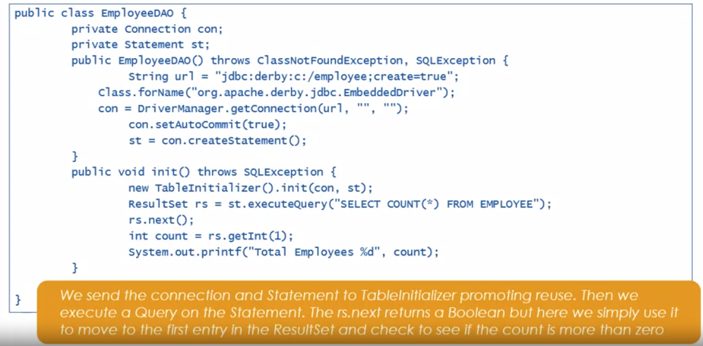
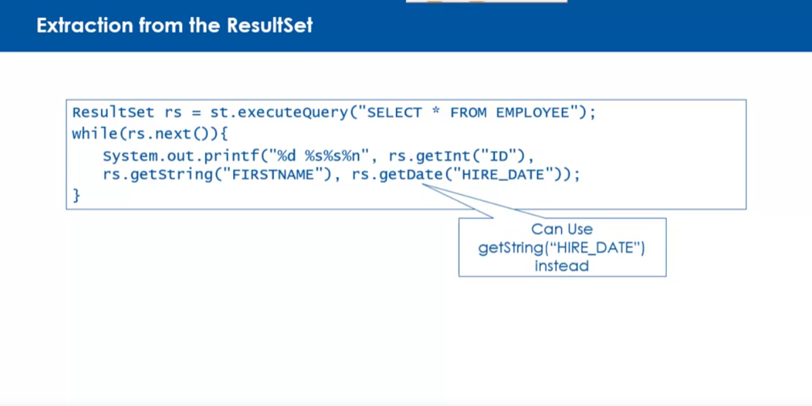
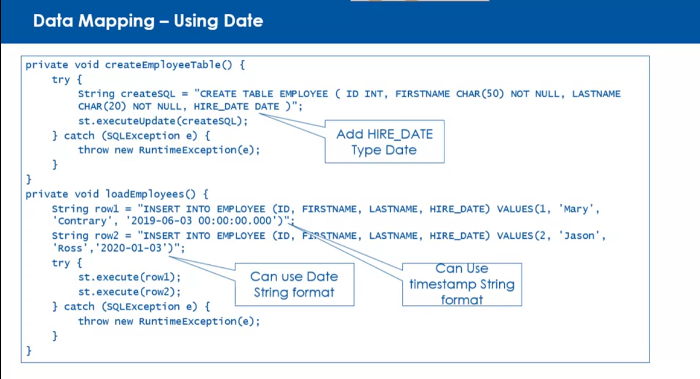

# Creating a Database Connection

## 1. Connecting to the Database

- Use DriverManager class

```java
DriverManager.getConnection("jdbc:db://localhost:1527//trainingDb");
```

## 2. Using JDBC Driver

- Starting with JDBC 4.0, Driver Manager will check the classpath for a jar file containing META-INF/services/java.sql.Driver file.
- Manually loading the driver by calling Class.forName()

```java
Class.forName("com.mysql.jdbc.Driver");
```

- You can also add the Driver class to the java.lang.System property jdbc.drivers

```java
System.setProperty("jdbc.drivers", "com.mysql.jdbc.Driver");
```

## 3. Connecting to the DB with DriverManager

```java
Connection conn = DriverManager.getConnection("jdbc:mysql://localhost:3306/trainingDb", "user", "password");
```

# Statement

- Statement is provided by the Connection
- using the Connection.createStatement() method
- an SQLException is thrown if the connection is closed

```java
Connection conn;
Statement stmt;
try {
  conn = DriverManager.getConnection("jdbc:mysql://localhost:3306/trainingDb", "user", "password");
  stmt = conn.createStatement();
} catch(SQLException e) {
    System.out.println(e.getMessage());
}
```



# Handling Exception




# More on Statement

- Statement is used to send a SQL query to the database
- `Statement.executeQuery()` is used to execute a SELECT query
  - The query is provided by the String
  - The result is returned as a **ResultSet**

```java
Connection conn;
Statement stmt;
try {
  conn = DriverManager.getConnection("jdbc:mysql://localhost:3306/trainingDb", "user", "password");
  stmt = conn.createStatement();
  ResultSet rs = stmt.executeQuery("SELECT * FROM employees");
} catch(SQLException e) {
    System.out.println(e.getMessage());
}
```

## Statement may be used to defined and load your database tables

```java
private void createEmployeeTable(){
  try{
    String createSQL = "CREATE TABLE employees (id INT PRIMARY KEY, name VARCHAR(255))";
    st.executeUpdate(createSQL);
  } catch (Exception e) {
    throw new RuntimeException(e);
  }
}
```

```java
private void loadEmployees(){
  String row1 = "INSERT INTO EMPLOYEE (ID, FIRSTNAME, LASTNAME) VALUES (1, 'John', 'Doe')";
  String row2 = "INSERT INTO EMPLOYEE (ID, FIRSTNAME, LASTNAME) VALUES (2, 'Jane', 'Doe')";
  try{
    st.execute(row1);
    st.execute(row2);
  } catch (Exception e) {
    throw new RuntimeException(e);
  }
}
```

# Executing an initial load

```java
Class TableInitializer {
  public void init(Connetion con, Statement stmt){
    this.con = con;
    this.st = stmt;
    dropTables();
    createEmployeeTable();
    loadEmployees();
  }
} ...
```

```java
private void dropTables(){
  try{
    st.executeUpdate("DROP TABLE employees");
  } catch (SQLException e) {
    System.out.println("Table employees does not exist");
    throw new RuntimeException(e);
  }
}
```



# Data Types

- Each database has its own data types, Java needs some way of mapping the data types found in a database to the data type use with java it self (SQL VARCHAR to Java String)
- Java provide 3 interfaces for woring with data types
  - java.sql.ResultSet
  - java.sql.PreparedStatement
  - java.sql.CallableStatement
    
    

## ResultSet

- Specific methods in these interfaces are used to perform the data mapping automatically
- All of RS method are specific to the data type of the column being accessed
- Can get by the name or column index

```java
ResultSet rs = stmt.executeQuery("SELECT * FROM employees");
while(rs.next()){
  int id = rs.getInt("id");
  String name = rs.getString("name");
  String role = rs.getString("1");
  // 1 mean the first column
}
```

# Prepared Statement

- a Subinterface of Statement
- Have all the same methods as Statement but with additional methods
- SQL is provided when a PreparedStatement is created
- Statement in contrast, SQL is provided when the statement is executed
  - **Perform better performance than Statement**

```java
public PreparedStatement prepareStatement(String sql) throws SQLException;
```

## A PreparedStatement maybe executed multiple times with different parameters

- A question mark (`?`) is used as a placeholder for the parameter

```java
String query = "SELECT * FROM employees WHERE id = ?";
PreparedStatement pstmt = conn.prepareStatement(query);
pstmt.setString(1, "SE181513");
```

- Using setXXX(parameterIndex, value) method to set the value of the parameter
  - XXX is a Java data type
  - ParameterIndex is the index of the parameter in the SQL statement (starting from 1)
  - Setter method assign the value to the parameter
- Parameters maybe cleared using the `clearParameters()`

## Executing a PreparedStatement

> 3 execution methods

- boolean **execute()**
  - any kind of SQL statement
- ResultSet **executeQuery()**
  - Return the ResultSet object generated by the query
- int **executeUpdate()**
  - Return the number of rows affected by the query
  - INSERT, UPDATE, DELETE or SQL Statement that return nothings -> DDL (Data Definition Language)

```java
public void updateCustomerName(int id, String firstName, String lastName){
  String query = "UPDATE employees SET firstName = ?, lastName = ? WHERE id = ?";
  try{
    PreparedStatement pstmt = conn.prepareStatement(query);
    pstmt.setString(1, firstName);
    pstmt.setString(2, lastName);
    pstmt.setInt(3, id);
    pstmt.executeUpdate();
  } catch (SQLException e) {
    throw new RuntimeException(e);
  }
}
```

# Meta Data

- Describes other data. It provides information about a certain item's content
- Example: Data = "Luu Cao Hoang"
  - Meta Data: 1. Length = 13 2. Type = String 3. Charset = UTF-8

## ResultSet provides method for creating an instance of ResultSetMetaData

```java
public ResultSetMetaData getMetaData() throws SQLException;
```

- Retrieve the number, types, and properties of the columns in a ResultSet object
  - int getColumnCount()
  - String getColumnName(int column)
  - int getColumnTye(int column)
  - boolean isNullable(int column)

```java
try(PreparedStatement pst = con.prepareStatement("SELECT * FROM Customers")){
  ResultSet rs = pst.executeQuery();
  ResultSetMetaData rsmd = rs.getMetaData();
  int columnCount = rsmd.getColumnCount();
  String label = rsmd.getColumnLabel(1);
  String type = rsmd.getColumnTypeName(1);
  System.out.println("Column count: " + columnCount);
  System.out.println("Label: " + label);
  System.out.println("Type: " + type);
}
```

```text
Column count: 6
Label: LAST_NAME
Type: VARCHAR
```

## DatabaseMetaData

- The Connection interface provides a method for creating an instance of DatabaseMetaData

```java
public DatabaseMetaData getMetaData() throws SQLException;
```

- String getDatabaseProductName()
- String getDatabaseProductVersion()
- ResultSet getCatalogs()

> Sometimes may useful with JDBC Driver information

- String getDriverName()
- String getDriverVersion()
- int getDriverMajorVersion()
- int getDriverMinorVersion()

# Escape Clauses

- JDBC Escape Syntax provides a way of smoothing out some of the differences in various DBMS vendors' implementation methods with SQL

  > 5 type of escape clauses

  1. LIKE wildcard literals
  2. Function handling
  3. Date and Time literals
  4. Stored procedure calls
  5. Outer joins

- Start with an opening curly brace `{` and end with a closing curly brace `}`
  - {keyword ... parameters ...}

|      Format      |                             Syntax                              |                                        Example                                        |
| :--------------: | :-------------------------------------------------------------: | :-----------------------------------------------------------------------------------: |
|       Date       |                        {d 'yyyy-mm-dd'}                         |                                   {d '2024-05-19'}                                    |
| Stored Procedure |                   {call procedure_name(?, ?)}                   |                               {call getEmployee(?, ?)}                                |
|    Outer Join    | {oj table1 LEFT OUTER JOIN table2 ON table1.col1 = table2.col1} | {oj employees LEFT OUTER JOIN departments ON employees.dept_id = departments.dept_id} |
|  Function Calls  |               {fn function_name(parameter1,...)}                |                                 {fn length('hello')}                                  |

# Stored Procedures

- A stored procedure is a prepared SQL code that you can save, so the code can be reused over and over again
- Stored Procedure Pros:
  - Keep SQL out of the Java Program
  - Better performance
  - Reduce network traffic
  - Reusability
  - Security
- Stored Procedure Cons:
  - Required cooperation between DBA and Developer
  - Must be rewritten if RDBMS is changed

## CallableStatement is used to execute stored procedures

- CallableStatement is a subinterface of PreparedStatement
- Use JDBC Escape Syntax
- Support placeholders for Stored Procedure parameters
- Support IN, OUT, and INOUT parameters

### Syntax:

- Basic: {call <procedure_name>[(?, ?)]}
- Return values: {? = call <procedure_name>[(?, ?)]}

```java
int loanAmount = 100000;
int termInMonths = 360;
double annRate = 0.045;
double pymt = 0.0;

CallableStatement cs = con.prepareCall("{call calc_payment(?, ?, ?, ?)}");
cs.setInt(1, loanAmount);
cs.setInt(2, termInMonths);
cs.setDouble(3, annRate);
cs.registerOutParameter(4, Types.DOUBLE);
//4th parameter is OUT, will return something to us
//type Double

cs.execute();
pymt = cs.getDouble(4); //pull of the value from the 4th parameter
cs.close();
```

## In case of you don't know the information of the stored procedure

- Use `DatabaseMetaData` to get the information

```java
ResultSet getprocedureColumns(String catalog, String schemaPattern, String procedureNamePattern, String columnNamePattern);
```

- Retrieve the description of the parameters and result columns of a stored procedure

Example:

```java
DatabaseMetaData dbmd = con.getMetaData();
ResultSet rs = dbmd.getProcedureColumns(null, null, "calc_payment", null);
while(rs.next()){
  String name = rs.getString("COLUMN_NAME");
  int type = rs.getInt("DATA_TYPE");
  System.out.println("Name: " + name + " Type: " + type);
}
```

```text
Name: loanAmount Type: 4
Name: termInMonths Type: 4
Name: annRate Type: 8
Name: payment Type: 8
```

- 4 corresponds to Types.INTEGER
- 7 corresponds to Types.REAL
- 8 corresponds to Types.DOUBLE
- 12 corresponds to Types.VARCHAR
