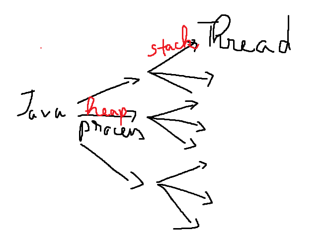

# Concurrency 
- Which prefers to an application doing more 
  than one thing at a time.
- Concurrency means that one task doesn't have to 
  finish before another one starts.

# Process
- A process is a unit of execution that has its own memory space.
- Each instance of a Java Virtual Machine (JVM) runs as a process (most of them)
- When we run a Java console application, we're kicking off a process.
- Terms process and application **interchangeably**.

# Heap
- If one Java appication is running and we run 
  another one, each application will have its 
  own memory space of **heap**.
- The first application can't access the memory 
  space of the second application.
- The heap isn't shared between applications.

# Thread 
- A thread is a unit of execution that runs within a process.
- Each process can have multiple threads.
- In Java, every process has at least one thread, the main thread.
- Each thread has what's called a **stack**, 
  which is the memory space that thread uses to run.

> So, every Java application runs a single 
> process, and each process can have multiple 
> threads. Every process has a heap, and every 
> thread has a thread stack