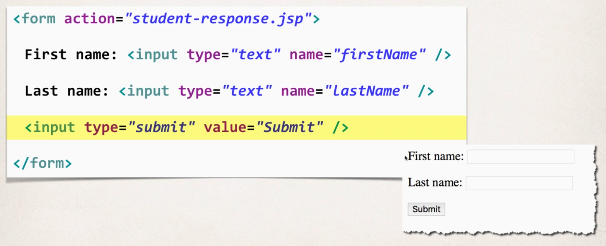
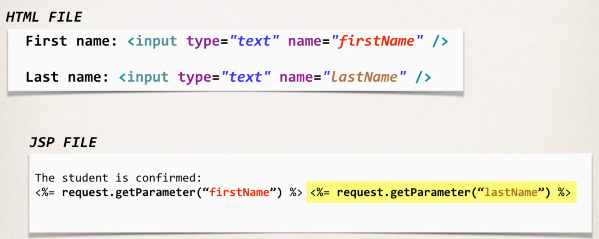
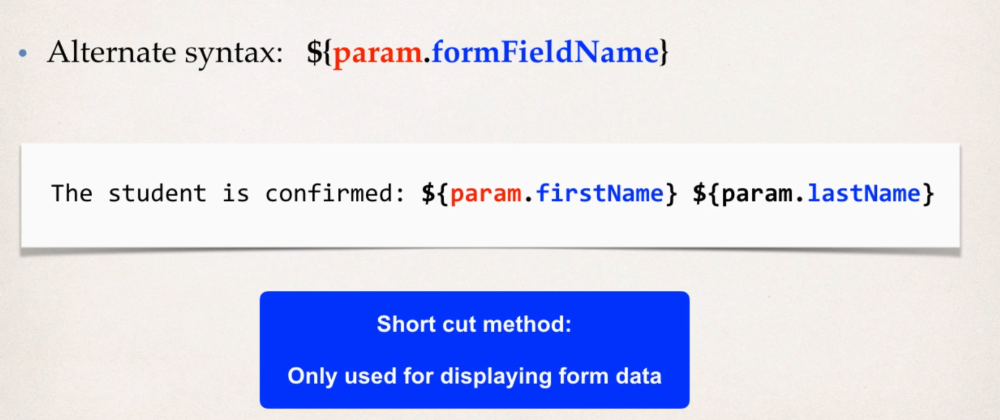
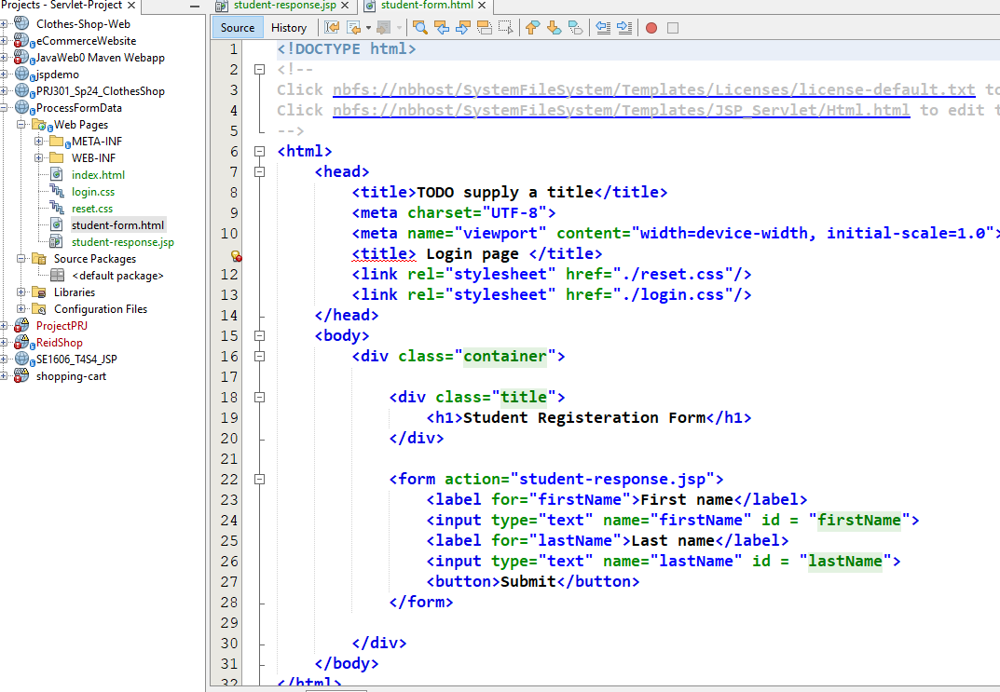
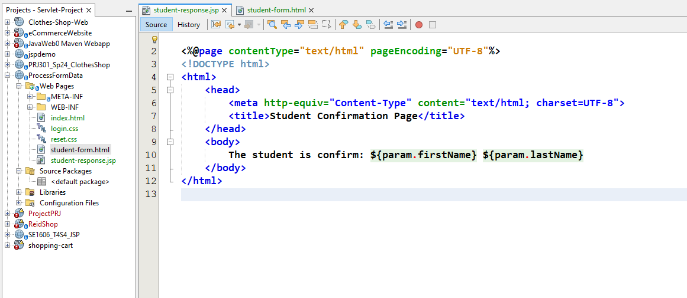
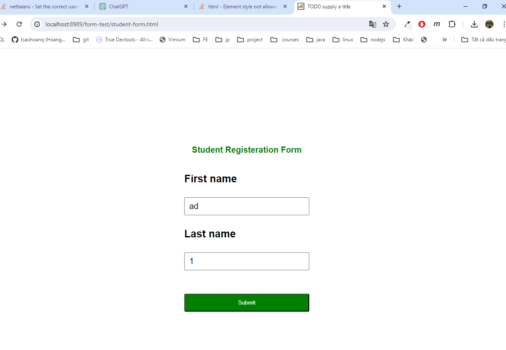
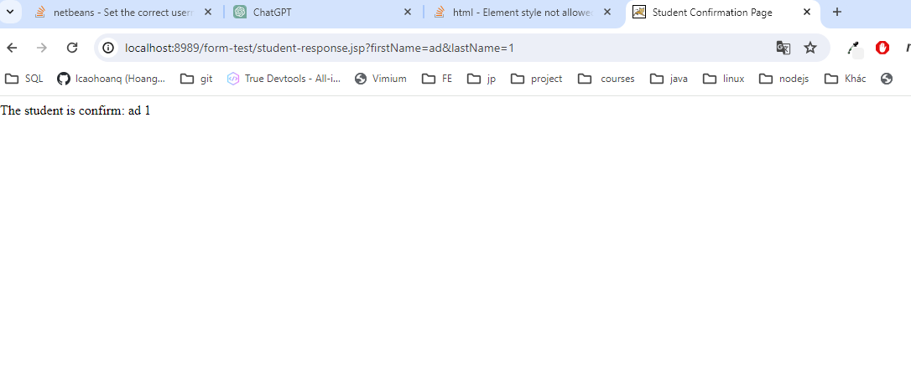

# Processing with Form Data

- action: URL to which the form data is sent
- method: HTTP method to be used when sending form data

> Using **request.getParameter()** method to retrieve form data

> Alternative shortcut
> 

# Drop-down list
- student-dropdown-form.html
- student-dropdown-response.jsp
# Radio button

- student-radio-form.html
- student-radio-response.jsp

# Checkbox
- student-checkbox-form.html
- student-checkbox-response.jsp