# What is a JSP file?

- AN HTM page with some Java code embedded in it
- Include dynamic content from a Java code

# Where is the JSP processed?
- JSP is processed on the server
- The server generates an HTML page and sends it to the client

# Where to place JSP file?
- The JSP file goes in your WebContent folder
- Must have the `.jsp` extension 

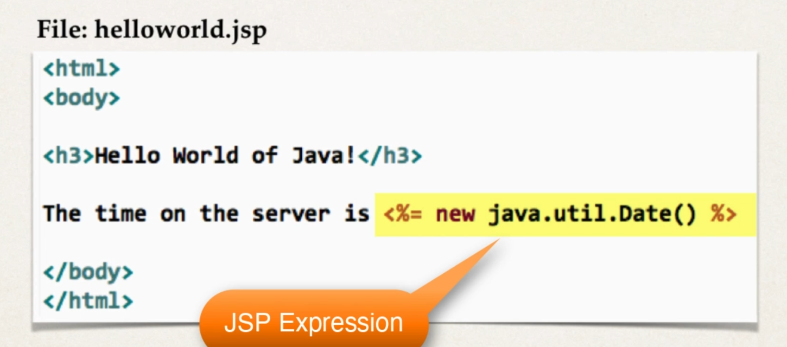

# Hello world
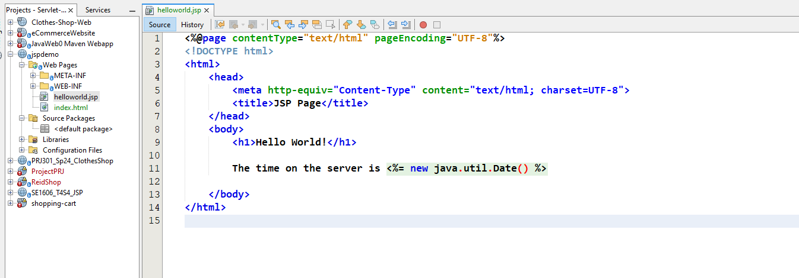!
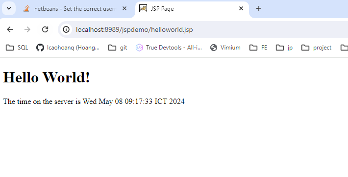

# JSP Expression
## 1. JSP expression:
  - `<%= some Java expression %>`

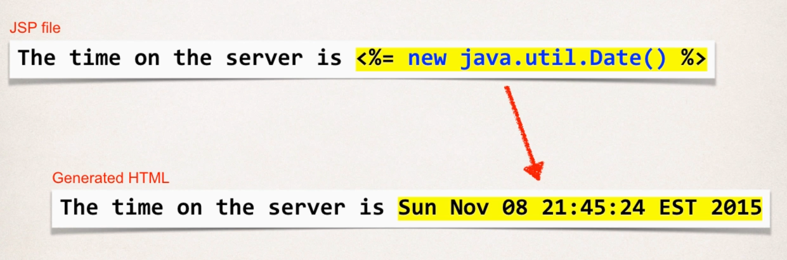
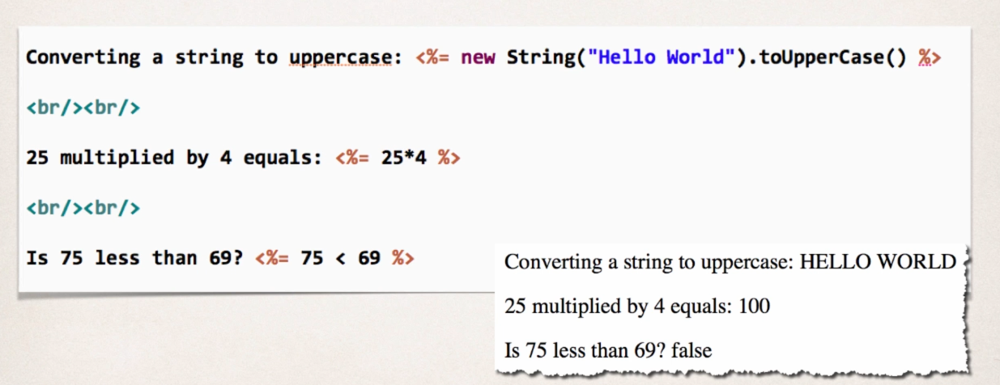

### Example:

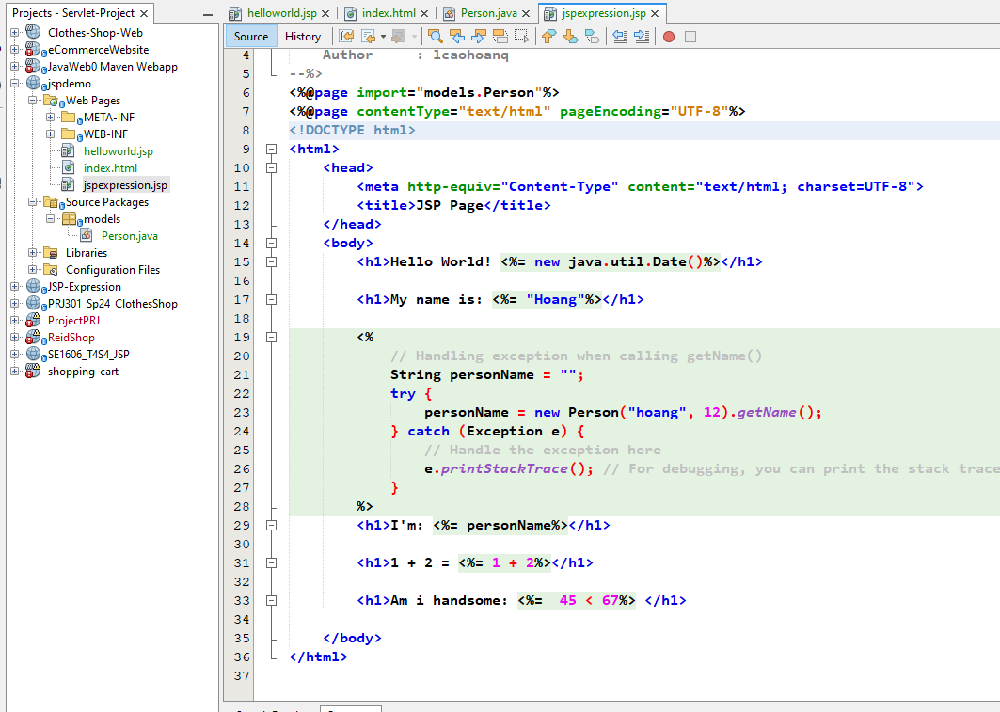
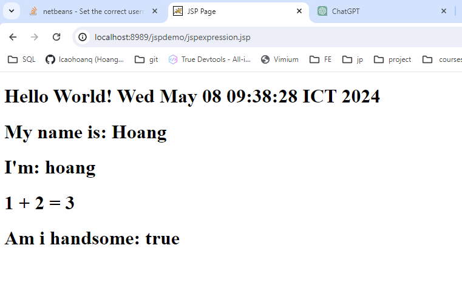

## 2. JSP Scriptlet:
  - `<% some Java code: 1 to many lines %>`
  - Insert 1 to many line of Java code
  - To include content in the HTML page use `out.print()`
> Best practice
- Minimize the amount of scriptlet code in a JSP
- Avoid dumping a lot of Java code in a JSP
- Refactor this into separate class... make use of MVC
### Example:

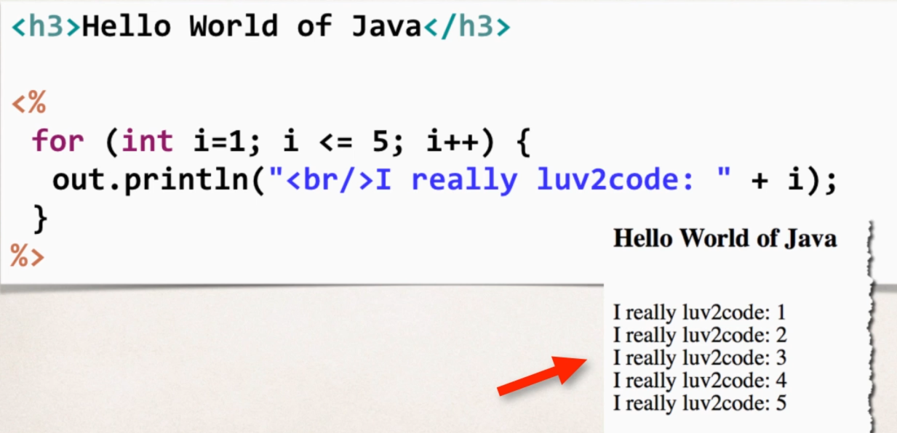
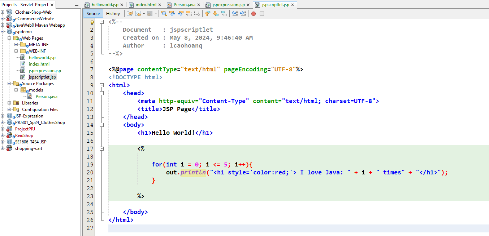
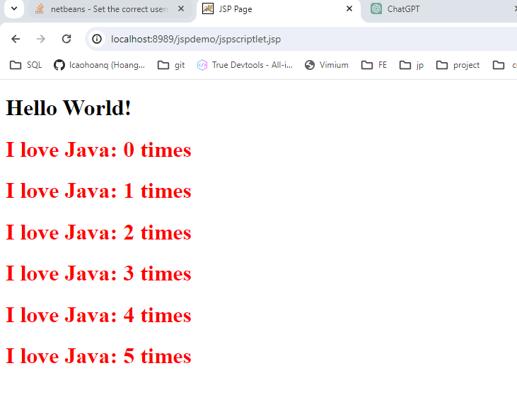

## 3. JSP Declaration:
  - `<%! variable or method declaration %>`
  - Declare a method or variable
  - Call it in the same JSP page
### Example:

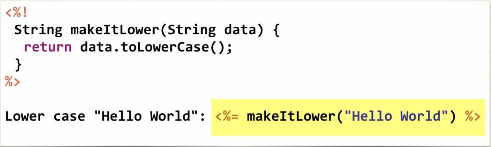
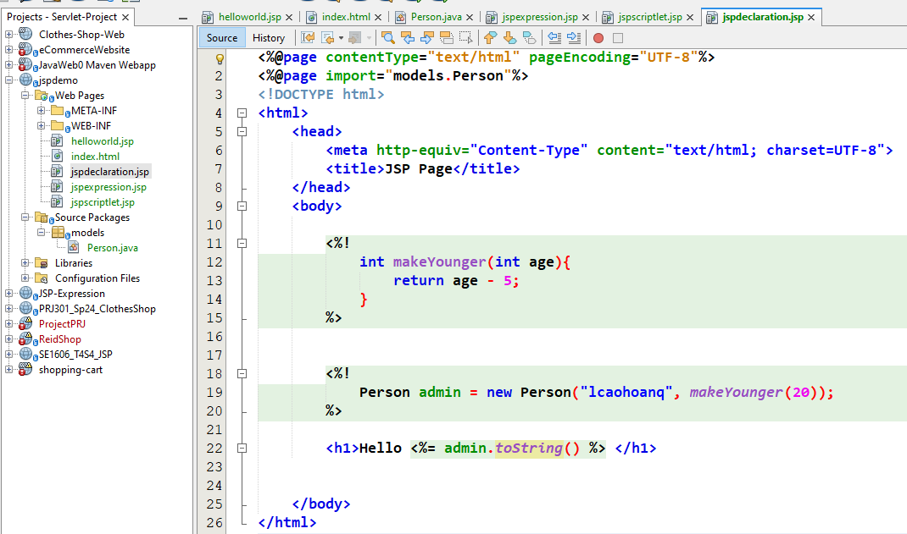
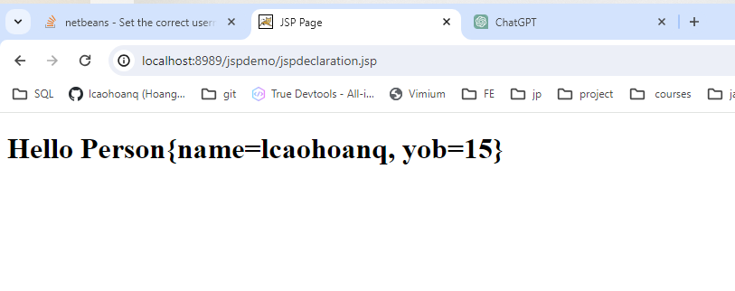

# Call a Java class From JSP
- Comma to separate the many import you need
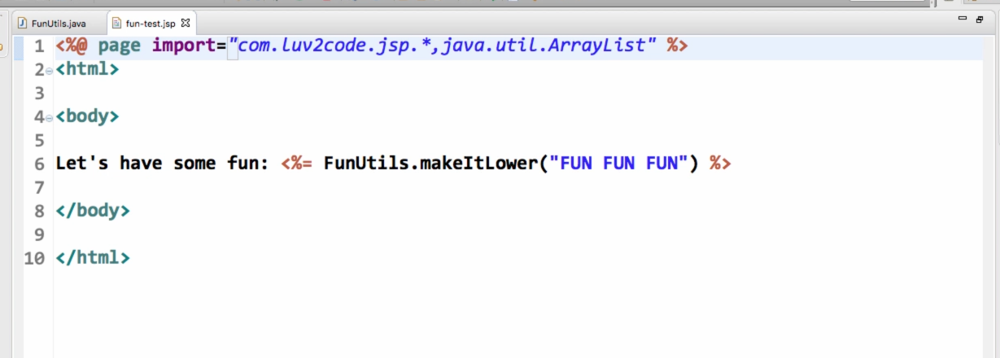

# JSP Built-in Server Object

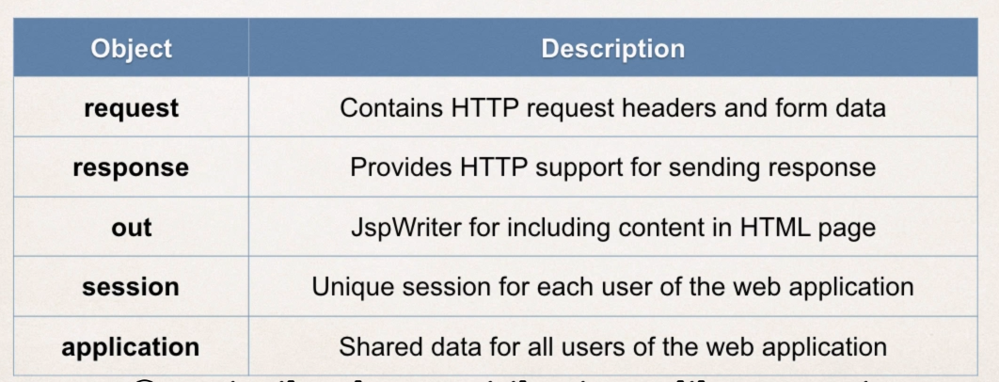get

# JSP including files

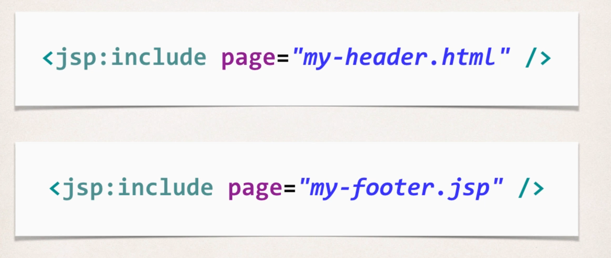