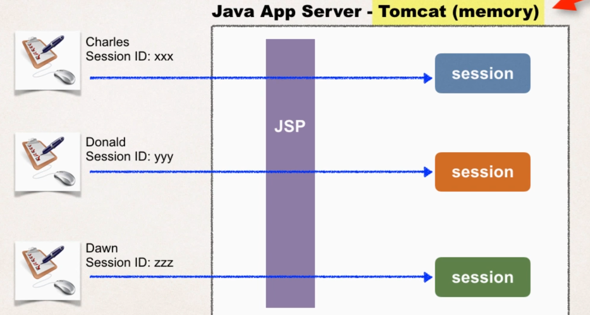
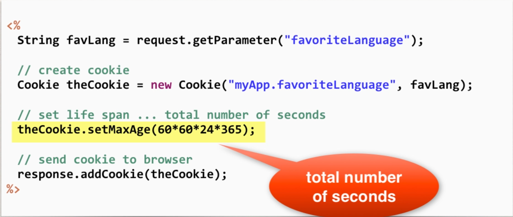
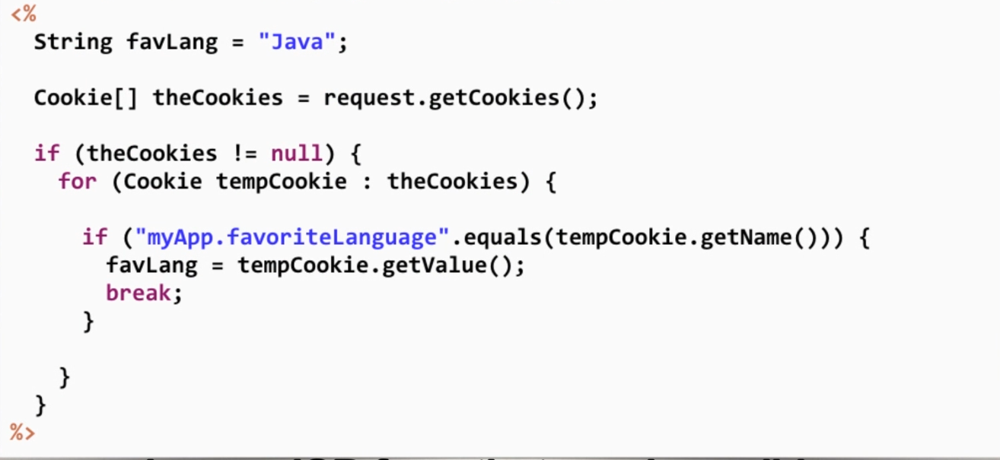

# JSP Session object
- JSP session is created once for user's browser session. Unique for this user
- Commonly used when you need to keep track of the user's actions
- Each browser's user have a unique session



- Session store at server's memory
- Each session have their own session ID (Tomcat handle)

# Method

### Add data to session object
```java
session.setAttribute(String name, Object value);
```

```java
List<String> items = new ArrayList<>();
session.setAttribute("myToDoList", items);
```

### Retrieve data from session object

```java
Object session.getAttribute(String name);
```

```java
List<String> items = (List<String>) session.getAttribute("myToDoList");
```

### Others useful

- isNew(): boolean
  - Return true if the session is new
- getId(): String
  - Return the session id
- invalidate() : void
  - Invalidates this session and unbinds any object associated with it 
- setMaxInactiveInterval(long mills): void
  - Sets the idele time for a session to expire. The value is supplied in milliseconds

# Cookies
> Text data exchanged between web browser and server
- Personalize a website for a user
- Keep track of user preferences
  - Favorite programming language: Java 
  - Favorite departure airport: Tan Son Nhat (SGN)
- Store long-term user data 
- **At most 20 cookies per domain per path**

## How are Cookies passed?
- Browser will only send cookies that match the server's domain name

## Cookie API - Package
> javax.servlet.http

```java
Cookie(String name, String value);
```
- Constructs a cookies with a specific name of value


- setMaxAge(second) 
  - default value is 0, mean that when user close browser, cookies will expire
  - we need to do math here, lmao 
  - 60 x 60 x 24 x 365 = 1 year

## Cookies API - Reading Cookies from the Browser
- We want to show the custom page of users bases on their cookies next time

