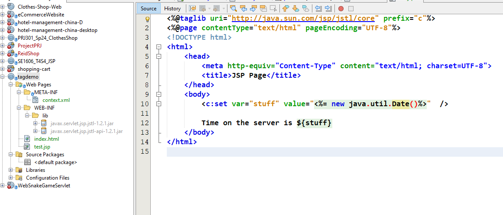
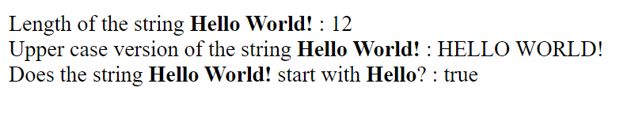

# JSP Tags

## JSP Custom  Tag
- Move heavy business login into supporting class
- Insert JSP Custom tag to use supporting class

### Benefit
- Minimize the amount of scriptlet code in JSP
- Avoids dumping thousands of lines of code in a jsp
- JSP page is simple ... main focus of JSP is only the presentation
- Tag is reusable

## JSP Standard Tag Library (JSTL)
- Oracle created a specification for a set of standard tags
  - Core
  - Messages Formatting I18N
  - Functions 
  - XML
  - SQL (bad practice)

**javax.servlet.jsp.jstl-api-1.2.1.jar**

- This contains the JSTL API interfaces and support classes. However a large number of the interfaces do not have implementation classes.

**javax.servlet.jsp.jstl-1.2.1.jar**

- This contains an implementation of the JSTL API. This code implements all of the interface from the API above.




### JSP Core Taglib Reference
- Every page that uses the Core tags must include this reference
```java
<%@taglib uri="http://java.sun.com/jsp/jstl/core" prefix="c"%>
```

## Core Tags


>Demo forEach


> 


- JSP will automatically call the method


>Demo If condition
```java
<table border="1">
    <tr>
        <th>First Name</th>
        <th>Last Name</th>
        <th>Gold Customer</th>
    </tr>
    <c:forEach var="student" items="${myStudentList}">
        <tr>
            <td>${student.firstName}</td>
            <td>${student.lastName}</td>
            <td>
                <c:if test="${student.goldCustomer}">
                    Special Price
                </c:if>
                <c:if test="${ not student.goldCustomer}">
                    -
                </c:if>
            </td>
        </tr>
    </c:forEach>
</table>
```

> choose tag
```java
<td>
    <c:choose>
        <c:when test="${student.goldCustomer}">
            Special Price
        </c:when>
        <c:otherwise>
            Normal Price
        </c:otherwise>
    </c:choose>
</td>

```

## Function Tags

```java
<%@taglib uri="http://java.sun.com/jsp/jstl/functions" prefix="fn"%>
```




