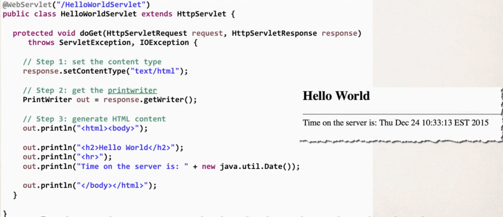
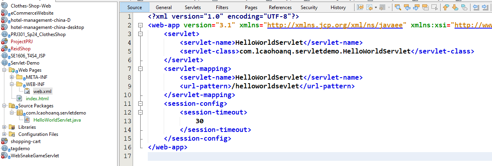
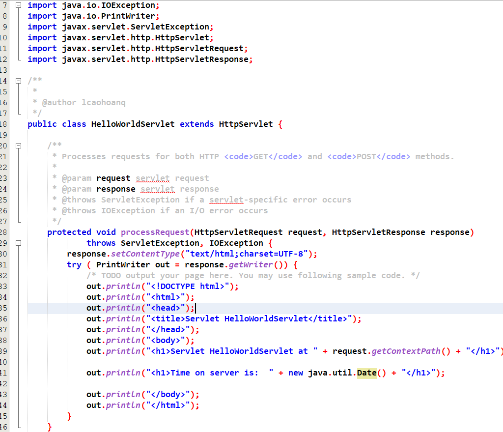
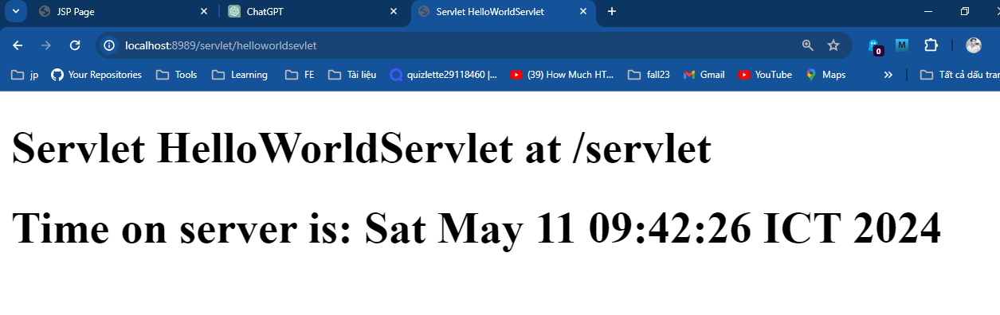

# Servlet
## What are Servlets?
> javax.servlet.http.HttpServlet
- Java clas that is processed on the Server
- Java class generates HTML that is returned to browser
- Can read HTML form data, use cookies and sessions etc
- At a high-level, similar functionality to JSPs
- Servlets are more powerful than JSPs

> Overide the doGet() and doPost()

# Flow
- When create a new Servlet, i have adjust the url pattern of the servlet

- Already mapping, so i do not need to specify the anotation @WebServlet("/helloworldsevlet")

- Mean that when i access the url: http://localhost:8989/servlet/helloworldsevlet, the servlet will be called and process with the doGet() method, doGet() continue call processRequest() method

# What is the difference between Servlet and JSP?
> Which one should I use if both have serve the same purpose?

## JSPs
- HTML file with .jsp extension
- Contains static HTML
- JSP to generate HTML
- Has built-in JSP objects

## Servlets
- Java class that is processed on the server
- Java class generates HTML that is returned to the browser
- More step to access web objects

> Can use either one for build web applications
## Best practice
- Integrate them both together!
  - Use JSPs for the presentation view
  - Use Servlets for the business logic
> Model-View-Controller (MVC) design pattern