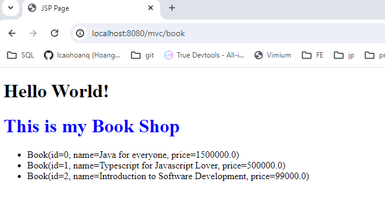

# MVC (Model-View-Controller)


# Servlet can call JSP using a request dispatcher
```java
request.getRequestDispatcher("/login.jsp").forward(request, response);
```

# Sending data from Servlet to JSP

- Using request.setAttribute("name", "value")
- You can as long as many attribute as you want, but it need to have unique name 


## Perform demo MVC

/demo


- included the jstl tag core


- Result


## A little advanced


- /book




- Now we need to convert this object data to a table format