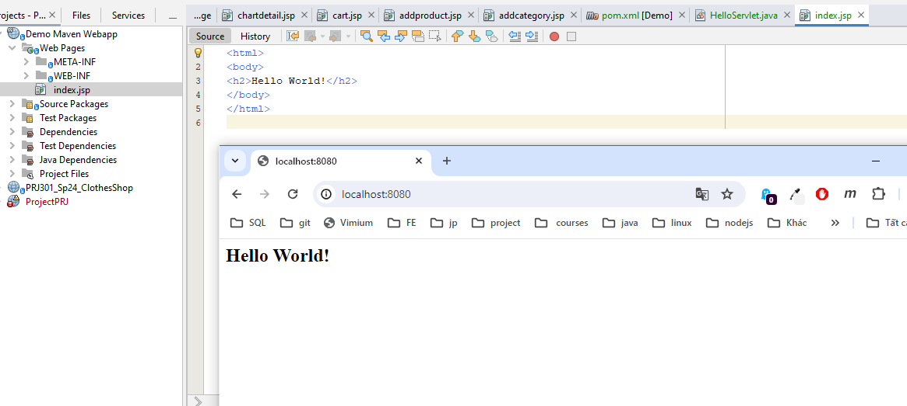
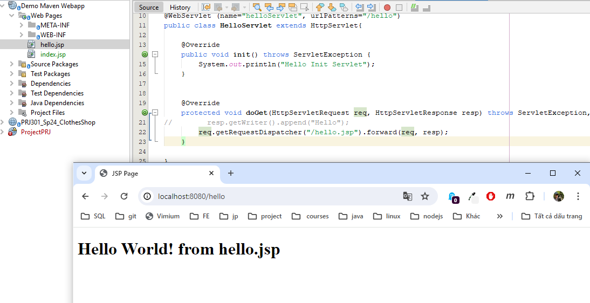
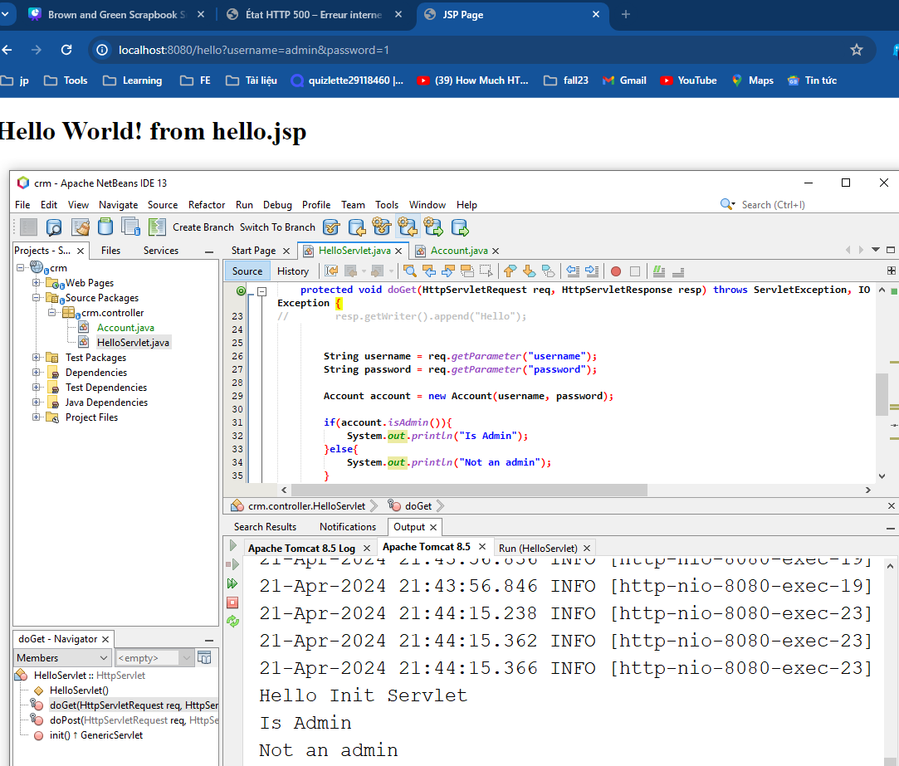

# Web Server

- Web Server là máy chủ cài đăt chương trình phục vụ các ứng dụng web
- Web Server có nhiệm vụ nhận **request** (yêu cầu) từ client, xử lý và trả về **response** (phản hồi) cho client thông qua giao thức HTTP (hoặc các giao thức khác)
  > HTTP Request: Yêu cầu từ client
  >
  > HTTP Response: Phản hồi từ server

# HTTP là gì?

- HTTP (HyperText Transfer Protocol) là giao thức truyền tải siêu văn bản

# HTTP Headers

## Request Headers:

- Chứa những thông tin kèm theo khi client gửi request lên server
- Sample data:
  - Host: địa chỉ trang web mà client muốn gửi request
  - Accept-Encoding: định dạng dữ liệu mà client muốn nhận từ server
  - User-Agent: thông tin về hệ điều hành và trình duyệt của client
  - Cookie: thông tin về phiên làm việc của client
  - Accept-Language: ngôn ngữ mà client muốn nhận từ server

## Response Headers:

- Chứa những thông tin kèm theo khi server trả về response cho client
- Sample data:
  - Content-Type: định dạng dữ liệu mà server trả về cho client
  - Content-Length: kích thước dữ liệu mà server trả về cho client
  - Set-Cookie: thông tin về phiên làm việc của client
  - Expires: thời gian mà dữ liệu trả về từ server sẽ hết hạn

# Java Servlet

- Servlet là một bộ thư viện của Java dùng để tạo các ứng dụng web (website/web application)
- Annotation `@WebServlet`: đánh dấu một class là một Servlet
  - `name`: tên của Servlet
  - `urlPatterns`: đường dẫn URL mà Servlet sẽ phục vụ
  - `extends HttpServlet` (abstract class): Servlet phải kế thừa từ HttpServlet để xử lý các request và response

```java
@WebServlet (name = "loginServlet", urlPatterns = "/login")
public class LoginServlet extends HttpServlet {

    @Override
    protected void doGet(HttpServletRequest req, HttpServletResponse resp) throws ServletException, IOException {
        super.doGet(req, resp); // Generated from nbfs://nbhost/SystemFileSystem/Templates/Classes/Code/OverriddenMethodBody
    }

    @Override
    protected void doPost(HttpServletRequest req, HttpServletResponse resp) throws ServletException, IOException {
        super.doPost(req, resp); // Generated from nbfs://nbhost/SystemFileSystem/Templates/Classes/Code/OverriddenMethodBody
    }
}
```

- Mặc định root ('/') là một trang Hello World!

- Default index.jsp



- Serve `hello.jsp` file



# Servlet LifeCycle

### Có 5 bước:

1. Load Servlet: Servlet Container tải Servlet vào bộ nhớ
2. Create Servlet: Servlet Container tạo một instance của Servlet
3. Call `init()` method: Servlet Container gọi phương thức init() của Servlet
4. Call `service`()` method: Servlet Container gọi phương thức service() của Servlet
5. Call `destroy()` method: Servlet Container gọi phương thức destroy() của Servlet

- doGet(), doPost(), doPut(), doDelete()... là các phương thức của service() method được gọi đi gọi lại nhiều lần

# JSP

- JSP (Java Server Pages) là một công nghệ cho phép viết mã Java và HTML trong cùng một file
- Default index.jsp


- Serve `hello.jsp` file


# GET - POST

## GET

- Dữ liệu được gửi từ client lên server thông qua các tham số trên URL
- Các tham số mà phương thức GET gửi lên sẽ bắt đầu bằng dấy `?` và cách nhau bởi dấu `&`
- Giới hạn tối đa **2048 kí tự**
- Ví dụ:
  - `http://localhost:8080/hello?name=John&age=20`
  - `http://localhost:8080/hello?name=John&age=20&address=Hanoi`

## POST

- Dữ liệu được gửi từ client lên server thông qua **body** của request
- Phương thức POST gửi thông tin thông qua HTTP Header và thường được gửi dưới dạng form
- Không giới hạn kích thước dữ liệu

# Servlet Request

### HTTPServletRequest

> là một interface trong package javax.servlet.http, cung cấp các method dùng để đọc các thông tin từ client gửi lên trong Header của HTTP Request

- getParameter(String name): trả về giá trị của tham số được gửi lên từ client

```java
String name = req.getParameter("name");
```



- getContextPath(): trả về URL của request

```java
String url = req.getContextPath();
```

- getServerName(): trả về địa chỉ của server

```java
String serverName = req.getServerName();
```

- getMethod(): trả về phương thức của request

```java
String method = req.getMethod();
```

- getQueryString(): trả về chuỗi query của request
- getCookies(): trả về mảng các cookie của request
- getSession(): trả về session của request

### Bài tập

- Demo một form login và validate với Servlet
  > `login.jsp`

```html
<body>
  <form action="http://localhost:8080/login" method="post">
    <input type="text" name="username" placeholder="Username" />
    <input type="text" name="password" placeholder="Password" />
    <button>Login</button>
  </form>
</body>
```

- action: đường dẫn của page servlet xử lý
- Khi ta click button `Login`, các tham số sẽ được truyền vào action, form gửi request lên server thông qua phương thức `POST` và Servlet sẽ nhận request này và xử lý

> `loginServlet.java`

```java
package crm.controller;

import java.io.IOException;
import javax.servlet.ServletException;
import javax.servlet.annotation.WebServlet;
import javax.servlet.http.HttpServlet;
import javax.servlet.http.HttpServletRequest;
import javax.servlet.http.HttpServletResponse;

@WebServlet (name = "loginServlet", urlPatterns = "/login")
public class LoginServlet extends HttpServlet {

    @Override
    protected void doGet(HttpServletRequest req, HttpServletResponse resp) throws ServletException, IOException {
        req.getRequestDispatcher("/login.jsp").forward(req, resp);
    }

    @Override
    protected void doPost(HttpServletRequest req, HttpServletResponse resp) throws ServletException, IOException {
        String username = req.getParameter("username");
        String password = req.getParameter("password");

        if(username.equals("admin") && password.equals("123456")){
            resp.sendRedirect(req.getContextPath() + "/hello");
        }else{
            req.getRequestDispatcher("/login.jsp").forward(req, resp);
        }
    }
}

```
