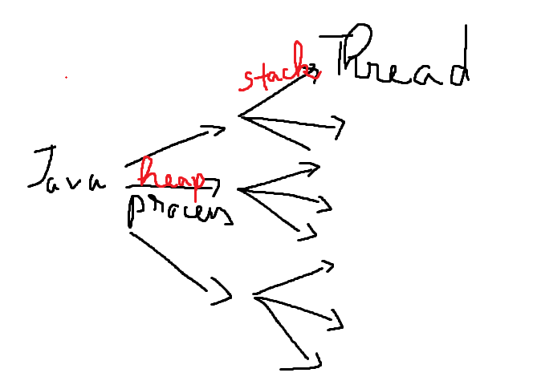

# Concurrency

- Which prefers to an application doing more
  than one thing at a time.
- Concurrency means that one task doesn't have to
  finish before another one starts.

# Process

- A process is a unit of execution that has its own memory space.
- Each instance of a Java Virtual Machine (JVM) runs as a process (most of them)
- When we run a Java console application, we're kicking off a process.
- Terms process and application **interchangeably**.

# Heap

- If one Java appication is running and we run
  another one, each application will have its
  own memory space of **heap**.
- The first application can't access the memory
  space of the second application.
- The heap isn't shared between applications.

# Thread

- A thread is a unit of execution that runs within a process.
- Each process can have multiple threads.
- In Java, every process has at least one thread, the main thread.
- Each thread has what's called a **stack**,
  which is the memory space that thread uses to run.


> So, every Java application runs a single
> process, and each process can have multiple
> threads. Every process has a heap, and every
> thread has a thread stack

# Concurrency in Java

## Key Concepts and Explanation:

1. Simple Thread Creation:

We create a thread using Thread class by passing a Runnable implementation (SimpleTask). The thread
is started using thread.start() and the main thread waits for it to complete using thread.join().

2. ExecutorService:

ExecutorService allows managing a pool of threads. In the example, a thread pool of 3 threads is
created, and tasks (CallableTask) are submitted for execution. Future is used to get the result of
the asynchronous task. The executor is shut down after the tasks are completed.

3. Synchronization:

We demonstrate the use of synchronized keyword in SharedResource to ensure that increments to a
shared variable by multiple threads happen safely without data corruption.

4. Volatile:

The VolatileExample class demonstrates the use of the volatile keyword, which ensures that changes
to the running variable are visible across multiple threads. This is important in multi-threaded
environments to ensure proper visibility of changes to variables.

- ConcurrencyDemo.java

```text
=== Simple Thread Creation ===
Simple Task is running in a separate thread.

=== ExecutorService Example ===
Callable task with input 5 is running.
Callable task with input 10 is running.
Result of task 1: 10
Result of task 2: 20
All tasks finished.

=== Synchronization Example ===
Final value of shared resource: 2000

=== Volatile Example ===
Volatile thread is running...
Volatile thread is running...
Volatile thread is running...
Volatile thread is stopping...
Volatile thread stopped.
```