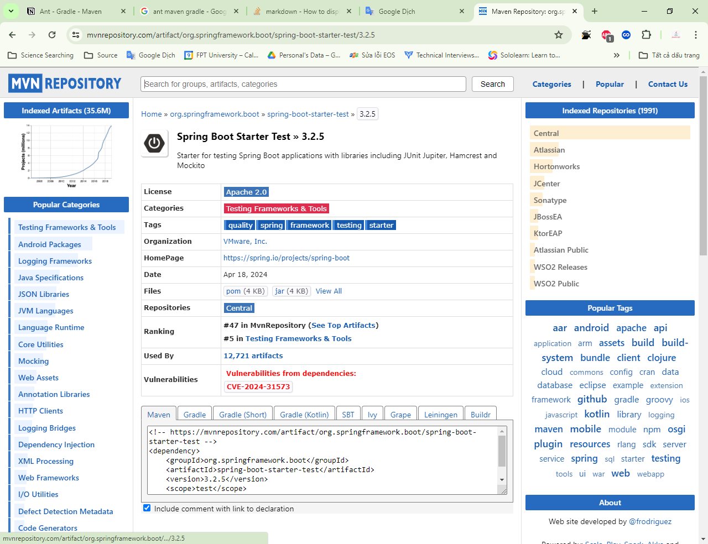

|| Ant | Maven | Gradle |
| :---: | :---: | :---: | :---: |
| Release data | 2000 | (2002) 2004 | (2007) 2008 |
| Popular using | beginner | 80% | 20% |

# All of them is the build tools

- A tools that package the code into a `.jar` file

# Which build tools have their own folder structure

```text
Ant (Another Neat Tool)
src\: source code
      .java
test\: test code
      .java
```

```text
Maven
src\: source code and test code
      main\
      test\
```

# The huge difference

## 1. Ant

> build.xml

- Using by default
- When need to add a new library, need to download the `.jar` file and add it to the `lib` folder -> annoying

### Problem

- Imagine that you have 100 libraries, you need to download 100 `.jar` files and add them to the `lib` folder
- Maybe that lib do not work with the current version of the project
- Maybe that lib is not compatible with the other libs
- Maybe can't not find that lib

## 2. Maven

> pom.xml (Project Object Model)

- Access mvnrepository.com: this is the repository of all the libraries
- Add the dependency to the `pom.xml` file
  

- Maven will download the `.jar` file and add it to the project
- Any jar file have 3 part:
  - groupID: the name of the company (ex: org.apache)
  - artifactID: the name of the library (ex: commons-lang3)
  - version: the version of the library (ex: 3.9)
