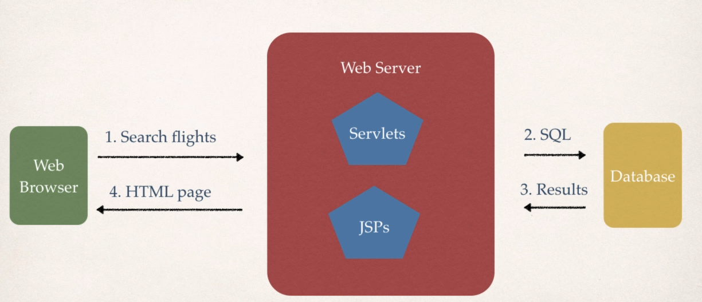

# Web Applications

## JSP and Servlets
- JSP: Java Server Pages
- Java code that runs on the server
- Read user's actions ... normally form HTML Form
- Process the data
- Return an HTML page that is generated dynamically

- JSPs and Servlets are key components of Java EE (Enterprise Edition)
- Popular MVC Frameworks are built on top of Servlets and JSPs
  - Spring
  - Struts
  - JFS