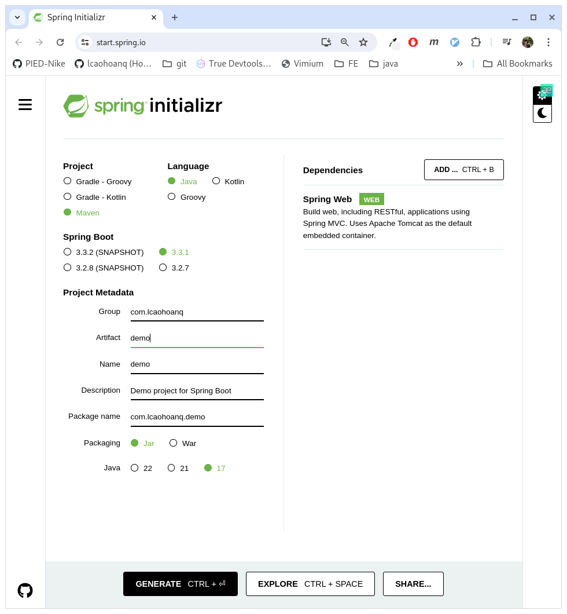

- Using pre-initialized project or manually create a new project
- Go to: https://start.spring.io/

- Spring 3.0 require Java 17 or later

# How to run
Before start project
- Ensure install docker (im using docker mysql container to migrate with Hibernate)
- Run command: docker compose up
- Start project
